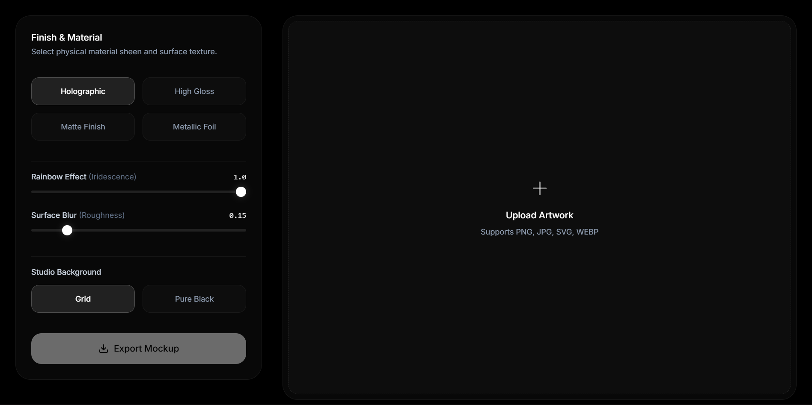
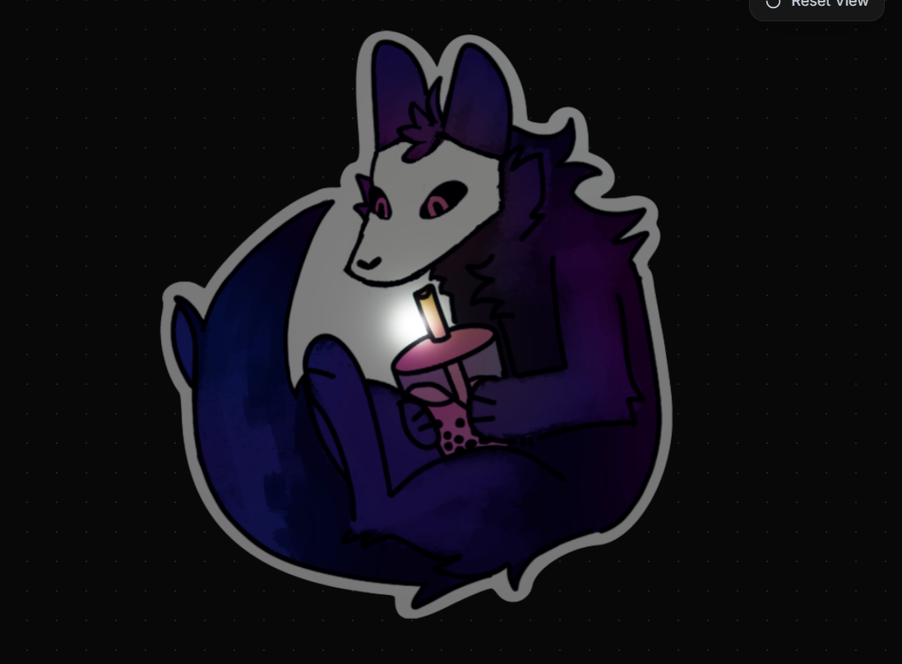
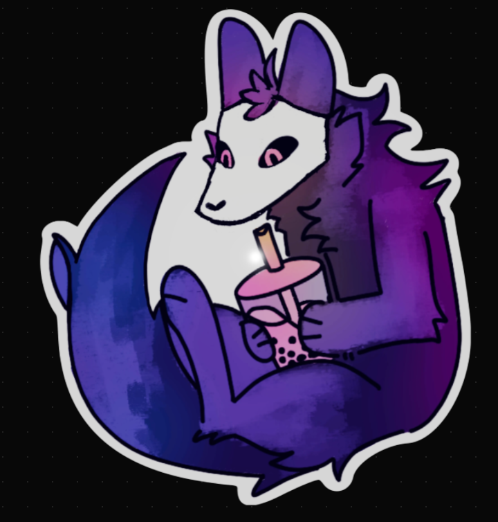
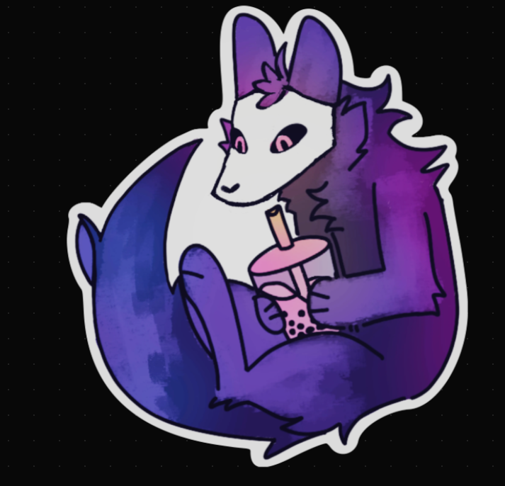
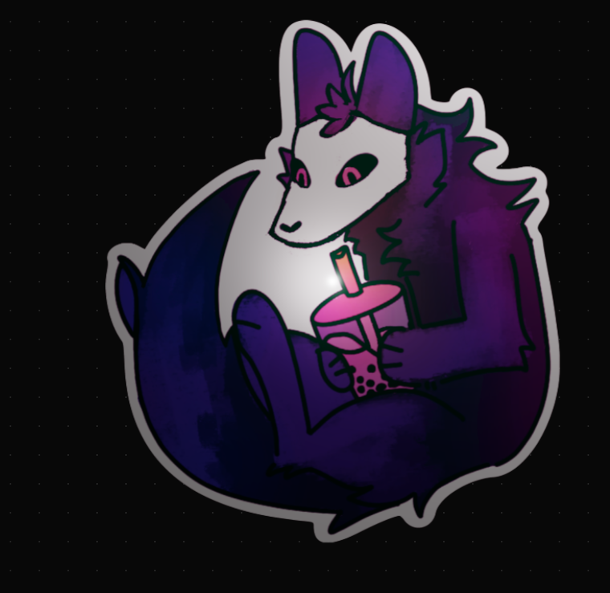

# mockyoursticker

An interactive, browser-based 3d studio for generating realistic holographic, high-gloss, matte, and foil sticker mockups in real time. built with **Three.js** and **WebGL** [because writing custom canvas shader math from scratch sounded like a fast track to a mental breakdown]. upload your artwork, tweak physical material finishes, orbit around in 3d space using cad-style controls, and export crisp PNG mockups instantly without melting your browser.
[**Time Taken**:6hrs]

*(full-screen studio view with custom holographic shaders running on a dark canvas)*

---

## features

- **Multi-Format File Support**: drag and drop or browse files in `PNG`, `JPG`, `WEBP`, or `SVG` formats [so you don't have to manually convert everything beforehand].
- **Physical Material Finishes**:
  - **Holographic**: iridescent rainbow sheen with customizable refraction and clearcoat [makes artwork look like an 80s rare foil trading card].
  - **High Gloss**: smooth, hyper-reflective polish.
  - **Matte Finish**: soft, non-reflective surface sheen [for that understated minimalist vibe].
  - **Metallic Foil**: heavy metallic sheen with subtle glitter texture.
- **Custom Lighting & Shader Controls**:
  - **Rainbow Effect (Iridescence)**: dial in the exact optical color-shifting intensity.
  - **Surface Blur (Roughness)**: fine-tune material surface grain and light diffusion so it actually feels like physical vinyl.
- **CAD-Style Viewport Controls**:
  - **Left-Click + Drag**: rotate sticker on 3D axes (1:1 direct tracking).
  - **Right-Click + Drag**: pan camera horizontally and vertically.
  - **Scroll Wheel**: smooth zoom in and out.
  - **Reset View Button**: instant panic button to reset camera orientation when you accidentally orbit off into the void.
- **Studio Canvas Modes**: toggle between a dark engineering grid and a pure pitch-black backdrop.
- **Optimized High-Res PNG Export**: asynchronous blob-based export rendering [so the main thread doesn't lock up and freeze your browser tab].
- **Minimal Dark Glassmorphism UI**: modern dark interface built for clarity without distracting eye-searing gradients.

---

## visual showcase

### Material Finishes

| Holographic | High Gloss | Matte Finish | Metallic Foil |
| :---: | :---: | :---: | :---: |
|  |  |  |  |

---

## known issues

- rendering complex iridescence shaders at maximum resolution on extremely old integrated graphics cards might cause minor frame dips [modern GPUs handle it without breaking a sweat].

---

## credits

- **Developer:** Pratham Rupera (`theonlydesigner`)
- **Graphics Engine:** Three.js / WebGL
- **Platform:** Built for Sticky YSWS
